# Mildew Detection in Cherry Leaves

This project was developed to address a real-world problem faced by Farmy & Foods, where cherry crops are affected by powdery mildew, a fungal disease that impacts product quality.

Traditionally, detecting this disease requires manual inspection of leaves, which is time-consuming and not scalable across large plantations. To improve efficiency, this project applies machine learning to automate the detection process using leaf images.

The project includes:
- A visual analysis to differentiate healthy leaves from those affected by powdery mildew
- A Convolutional Neural Network (CNN) model that predicts leaf health status
- An interactive dashboard built with Streamlit for real-time image prediction

👉 **Live Application:** https://cherryleaves-mildew-detector-f0f94503373d.herokuapp.com/

👉 **GitHub Repository:** https://github.com/gregp1985/mildew-detection-in-cherry-leaves

The model achieved 99% accuracy on unseen test data, exceeding the project requirement of 97%.

## Table of Contents

- [Project Overview](#project-overview)
- [Dataset Content](#dataset-content)
- [Business Requirements](#business-requirements)
- [Mapping Business Requirements to Data Visualisation and ML Tasks](#mapping-business-requirements-to-data-visualisation-and-ml-tasks)
- [ML Business Case](#ml-business-case)
- [Hypothesis and Validation](#hypothesis-and-validation)
- [Dashboard Design](#dashboard-design)
- [CRISP-DM Process](#crisp-dm-process)
- [Epics and User Stories](#epics-and-user-stories)
- [Technologies Used](#technologies-used)
- [Deployment](#deployment)
- [Testing](#testing)
- [Credits](#credits)

## Project Overview

Powdery mildew is a fungal disease that affects cherry crops and can significantly reduce product quality. Current detection methods rely on manual inspection, which is time-consuming and difficult to scale across large plantations.

This project aims to automate the detection process using machine learning, enabling rapid and accurate identification of infected leaves.

The solution combines:
- Visual data analysis to understand key differences between leaf types
- A Convolutional Neural Network (CNN) for classification
- A Streamlit dashboard for real-time prediction and user interaction

By automating this process, the system helps reduce inspection time and supports better decision-making in agricultural production.

## Dataset Content

The dataset contains images of cherry leaves provided by Farmy & Foods.

The images are categorised into two classes:
- Healthy: images of cherry leaves without disease
- Powdery Mildew: images of cherry leaves affected by fungal infection

Each image is a colour image with a resolution of 256x256 pixels.

The dataset is used to:
- Perform a visual study to differentiate healthy and infected leaves
- Train a machine learning model to classify leaf health status

### Dataset Split Distribution

The dataset was split into training, validation, and test sets.

The distribution shows that both healthy and powdery mildew images are present in each dataset split, ensuring balanced training and reliable evaluation of the model.

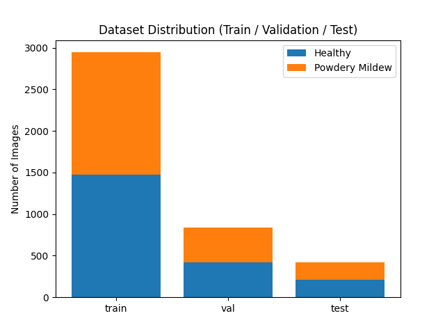

## Business Requirements

The client is interested in:

1. Conducting a study to visually differentiate a cherry leaf that is healthy from one that contains powdery mildew.
2. Predicting if a cherry leaf is healthy or contains powdery mildew using an ML system.

The client requires a dashboard that presents both the visual study and the predictive system.

## Mapping Business Requirements to Data Visualisation and ML Tasks

### Business Requirement 1: Visual Differentiation

- User Story: As a client, I want to understand the visual differences between healthy and infected leaves so that I can identify mildew patterns.

- Data Visualisation Tasks:
  - Generate average images for each class
  - Generate variability images for each class
  - Compare differences between average images
  - Create image montages

- Specific Actions:
  - Load and preprocess image data
  - Compute mean and standard deviation images
  - Visualise differences using matplotlib
  - Display results in the dashboard with explanations

---

### Business Requirement 2: Prediction System

- User Story: As a client, I want to upload leaf images and receive predictions so that I can quickly identify infected leaves.

- ML Tasks:
  - Train a Convolutional Neural Network (CNN)
  - Evaluate model performance using accuracy, confusion matrix, and classification report
  - Deploy model in a Streamlit dashboard

- Rationale:
  Machine learning is required to automate the classification of cherry leaf images, as manual inspection is not scalable. A Convolutional Neural Network (CNN) is appropriate due to its effectiveness in image classification tasks.

- Specific Actions:
  - Split dataset into train/validation/test sets
  - Apply image augmentation
  - Define CNN architecture
  - Train and validate the model
  - Save trained model
  - Integrate model into Streamlit app for predictions

## ML Business Case

The aim of this predictive analytics task is to build a supervised machine learning model that classifies cherry leaf images as either healthy or affected by powdery mildew.

- Learning Method:
  Supervised learning using a Convolutional Neural Network (CNN), which is well suited for image classification tasks.

- Ideal Outcome:
  A model that can accurately distinguish between healthy and infected leaves.

- Success Metrics:
  The model must achieve at least 97% accuracy, as agreed with the client.

- Model Output:
  A binary classification (Healthy / Powdery Mildew) along with a probability score indicating confidence.

- Relevance to the User:
  The model allows users to quickly assess leaf health by uploading images, significantly reducing the need for manual inspection and improving efficiency in agricultural operations.

- Heuristics:
  Images were resized to 100x100 pixels to reduce computational cost and model size while maintaining sufficient detail for classification.

- Training Data:
  The model was trained using a labelled dataset of cherry leaf images provided by the client.

The model achieved 99% accuracy on the test dataset, exceeding the business requirement.

## Hypothesis and Validation

### Hypothesis 1: Visual Differences Exist

Cherry leaves affected by powdery mildew have visible differences in colour and texture compared to healthy leaves.

**Validation:**
- Average images showed lighter, patchy regions in infected leaves
- Variability images highlighted irregular patterns
- Image montage confirmed visible fungal markings

---

### Hypothesis 2: A CNN Model Can Learn These Patterns

A Convolutional Neural Network can learn the visual differences between healthy and infected leaves.

**Validation:**
- The model achieved 99% accuracy on unseen test data
- The confusion matrix showed strong classification performance
- Loss and accuracy curves confirmed effective learning without overfitting

---

### Hypothesis 3: The Model Can Be Applied in a Real-World Tool

The trained model can be integrated into an interactive dashboard to support real-time decision-making.

**Validation:**
- The Streamlit dashboard allows users to upload images
- Predictions are returned instantly with probability scores
- The deployed Heroku application functions correctly with real test images

## Dashboard Design

The dashboard includes auxiliary functionality to handle and render predictions, allowing users to upload images and receive real-time classification results with probability scores.

Model evaluation is also presented through accuracy and loss plots and a confusion matrix, enabling users to assess the performance of the machine learning model.

### Page 1: Project Summary

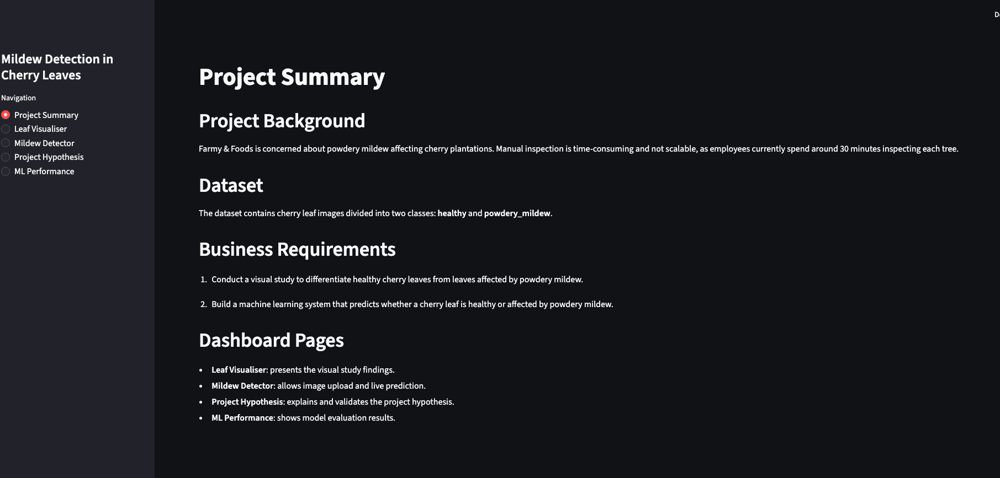

- Content:
  - Project background
  - Dataset description
  - Business requirements
- Purpose:
  - Provide context for the problem and dataset
- Widgets/Visuals:
  - Text sections
- Business Requirement:
  - Supports understanding of both requirements

---

### Page 2: Leaf Visualiser

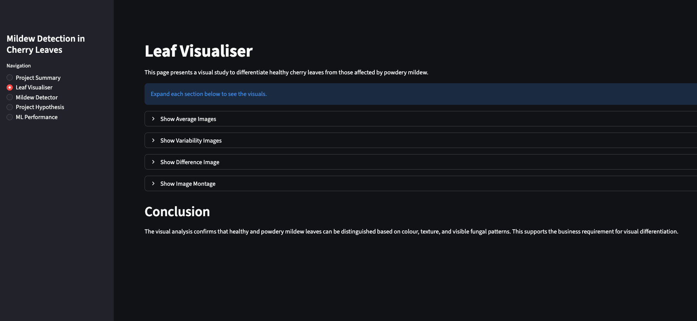

- Content:
  - Average images (healthy vs mildew)
  - Variability images
  - Difference image
  - Image montage
  - Interpretations for each visual
- Purpose:
  - Demonstrate visual differences between leaf classes
- Widgets/Visuals:
  - Expanders
  - Image plots
  - Text explanations
- Business Requirement:
  - Addresses Business Requirement 1

#### Plots

##### Average Images

The average images show clear differences in colour and texture between classes.

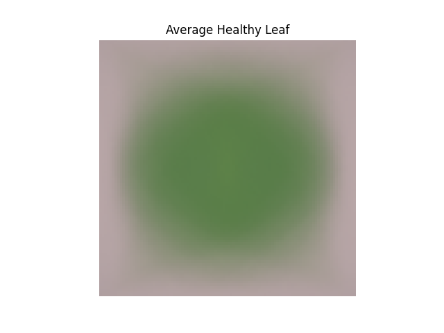
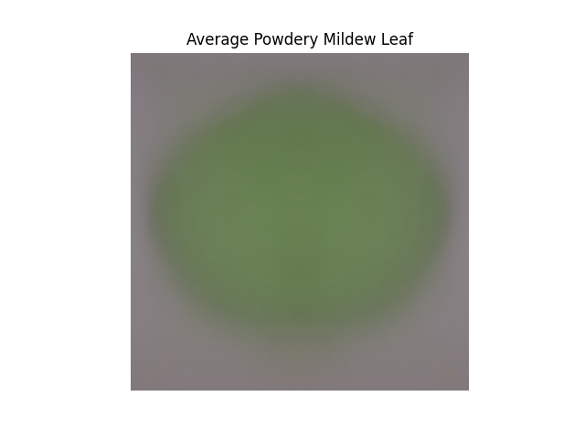

##### Variability Images

The Variability images show how pixel values differ across samples. Higher variability in mildew leaves suggests irregular patterns caused by infection.

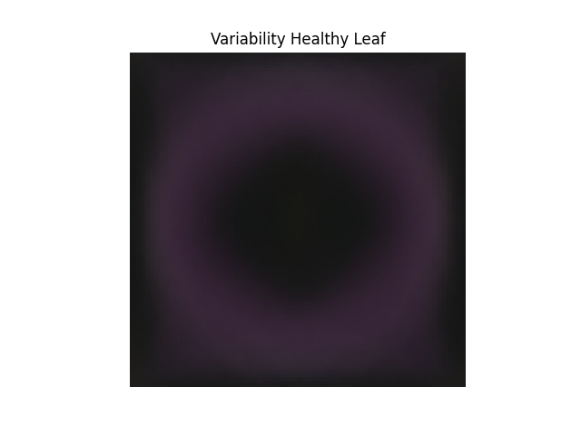
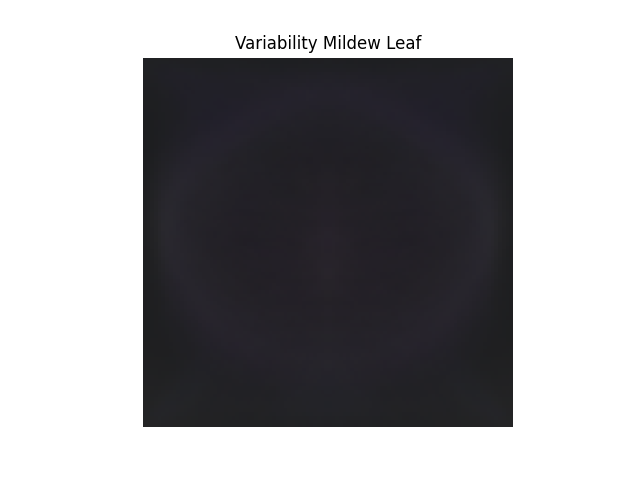

##### Difference Images

The difference image highlights regions where healthy and mildew leaves diverge, confirming that visual features can distinguish between classes.

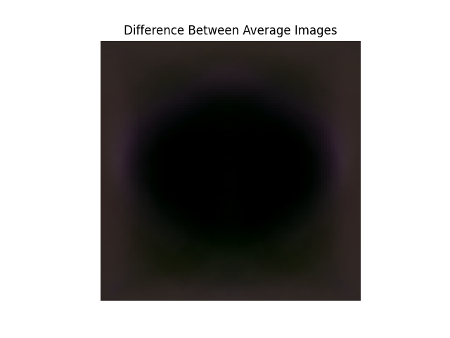

##### Image Samples

The montages show sample images from each class. Mildew leaves display visible white fungal patterns, while healthy leaves are uniformly green.

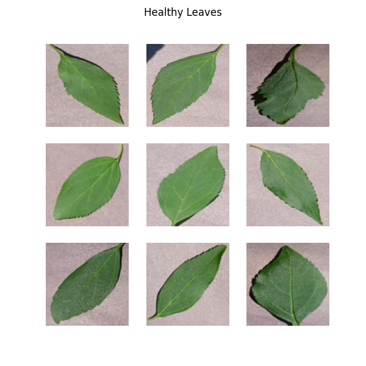
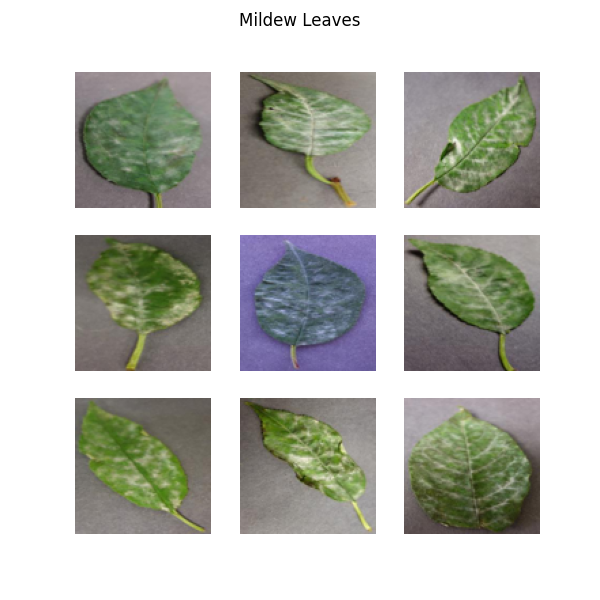

---

### Page 3: Mildew Detector

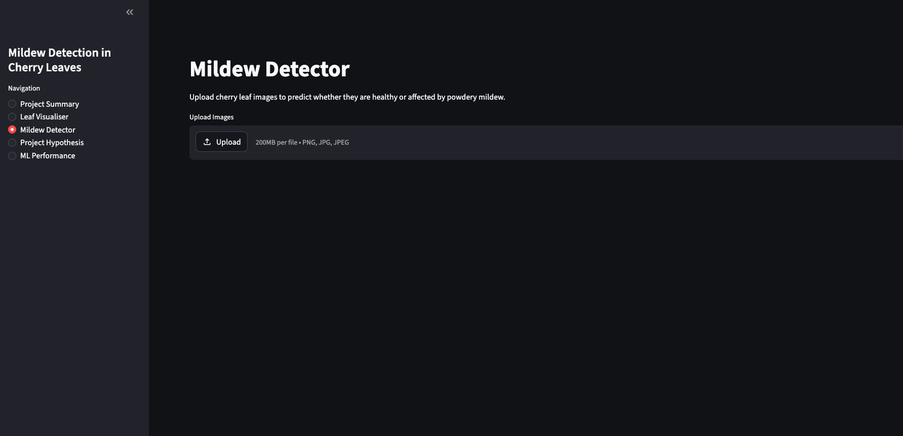

- Content:
  - Image upload widget (multiple images)
  - Prediction results with probability
  - Results table
  - CSV download button
- Purpose:
  - Provide real-time prediction capability
- Widgets/Visuals:
  - File uploader
  - Uploaded image previews
  - Dataframe
  - Download button
- Business Requirement:
  - Addresses Business Requirement 2

---

### Page 4: Project Hypothesis

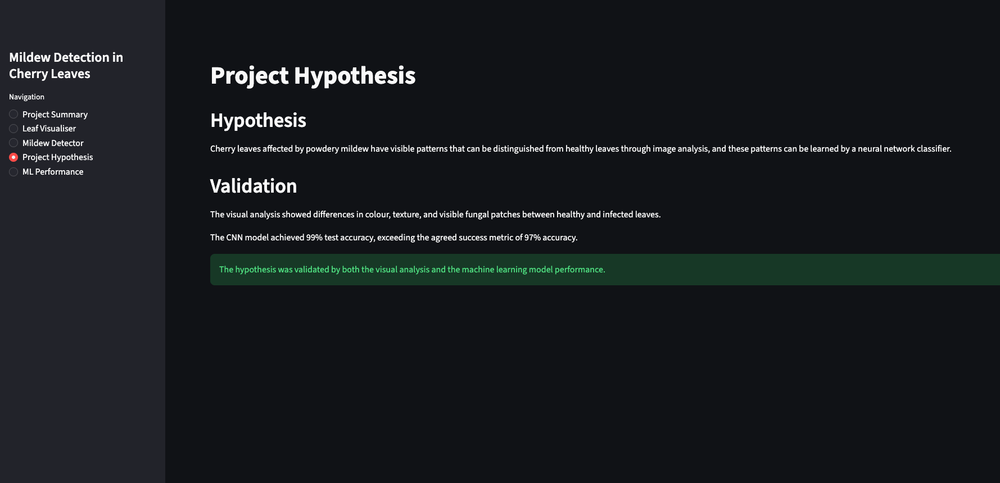

- Content:
  - Project hypothesis
  - Validation using visual analysis
  - Validation using model performance
- Purpose:
  - Demonstrate reasoning and validation of the approach
- Widgets/Visuals:
  - Expanders
  - Success messages
  - Text explanations
- Business Requirement:
  - Supports both business requirements by showing how the visual and ML approaches were validated.

---

### Page 5: ML Performance

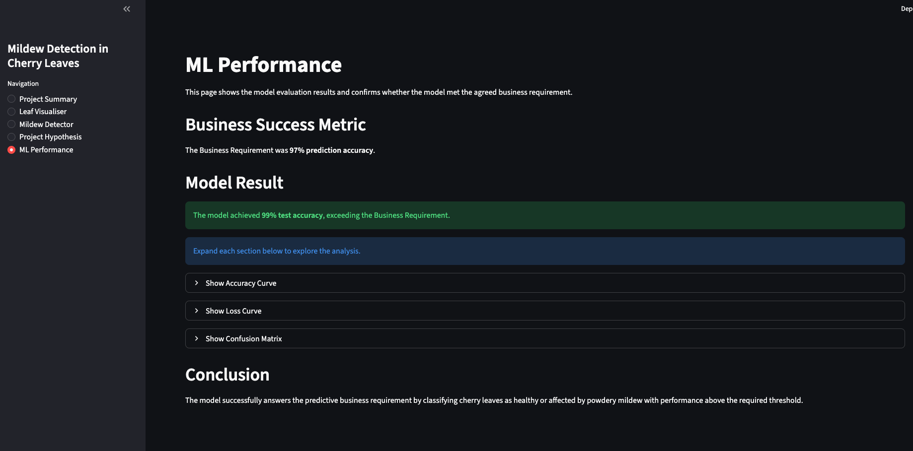

- Content:
  - Accuracy plot
  - Loss plot
  - Confusion matrix
  - Final evaluation statement
- Purpose:
  - Show model performance and confirm it meets business requirements
- Widgets/Visuals:
  - Expanders
  - Evaluation plots
  - Success message
- Business Requirement:
  - Addresses Business Requirement 2

#### Plots

##### Accuracy Curve

The accuracy curve shows how the model improved during training and validation.

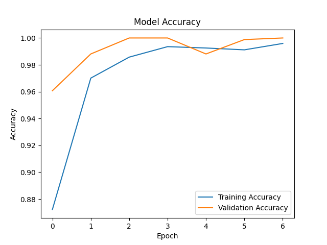

##### Loss Curve

The loss curve helps show whether the model learned effectively and whether there were signs of overfitting.

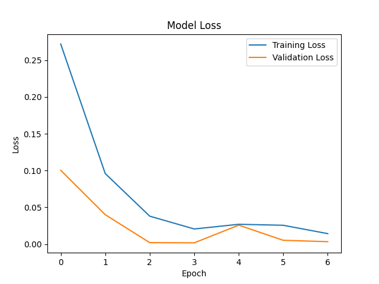

##### Confusion Matrix

The confusion matrix shows how many test images were correctly or incorrectly classified.

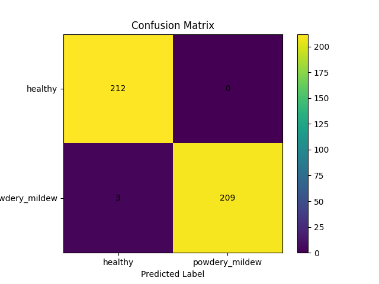

## CRISP-DM Process

### Business Understanding
This phase involved understanding the client’s need to reduce manual inspection time and improve detection accuracy of powdery mildew in cherry leaves.

The dataset was analysed to confirm it contained labelled images suitable for both visual analysis and supervised machine learning.

### Data Understanding
The dataset consisted of labelled images of cherry leaves categorised into healthy and powdery mildew classes.

### Data Preparation
Images were resized to 100x100 pixels and split into training, validation, and test datasets.

### Modelling
A Convolutional Neural Network (CNN) was trained using augmented image data.

### Evaluation
The model was evaluated using accuracy, loss curves, confusion matrix, and classification report.

### Deployment
The model was deployed using a Streamlit dashboard to allow user interaction and prediction.

## Epics and User Stories

### Epic 1: Project Understanding and Context

| User Story ID | User Story |
|---|---|
| US01 | As a client, I want to understand the project background so that I know why mildew detection is needed. |
| US02 | As a client, I want to view the business requirements so that I understand the project goals. |

---

### Epic 2: Visual Analysis of Leaf Data

| User Story ID | User Story |
|---|---|
| US03 | As a client, I want to see average images for healthy and mildew leaves so that I can compare their general appearance. |
| US04 | As a client, I want to see variability images so that I can understand where visual differences occur. |
| US05 | As a client, I want to see image montages so that I can view real examples from each class. |

---

### Epic 3: Machine Learning Prediction System

| User Story ID | User Story |
|---|---|
| US06 | As a client, I want to upload one or more cherry leaf images so that I can receive predictions. |
| US07 | As a client, I want each prediction to include a probability score so that I can understand model confidence. |
| US08 | As a client, I want prediction results in a table so that I can review multiple uploaded images together. |
| US09 | As a client, I want to download prediction results as a CSV file so that I can keep a record. |

---

### Epic 4: Model Validation and Insights

| User Story ID | User Story |
|---|---|
| US10 | As a client, I want to understand the project hypotheses so that I can see how the approach was validated. |
| US11 | As a client, I want to view model performance so that I can confirm the model meets the 97% target. |

---

### Epic 5: User Experience and Navigation

| User Story ID | User Story |
|---|---|
| US12 | As a user, I want clear navigation so that I can move between dashboard pages easily. |

## Technologies Used

- Python
- TensorFlow / Keras
- NumPy
- Pandas
- Matplotlib
- Scikit-learn
- Streamlit
- Git & GitHub

## Deployment

The application was deployed using Heroku.

Steps:
1. Create a Heroku app
2. Connect the app to the GitHub repository
3. Set buildpacks to Python
4. Deploy the application

Required files:
- Procfile
- requirements.txt
- runtime.txt
- setup.sh

The application can be accessed via the deployed URL.

The Heroku deployment was tested after release. The application loaded successfully, all dashboard pages were accessible, visual assets displayed correctly, and the Mildew Detector returned predictions for uploaded test images.

## Testing

### Model Testing

The model was evaluated on a test dataset that was not used during training.

- Test Accuracy: 99%
- The model exceeded the required 97% accuracy threshold.
- Confusion matrix showed high accuracy across both classes.

### Dashboard Testing

The dashboard was tested to ensure all functionality works as expected:

- All pages load correctly
- Images display properly
- Expanders open and close correctly
- File uploader accepts multiple images
- Predictions display correctly with probability
- Results table is generated correctly
- CSV download functionality works

### Manual Testing

- Uploaded healthy leaf images → correctly predicted as healthy
- Uploaded mildew images → correctly predicted as powdery mildew
- Tested with multiple images → results displayed correctly

This image shows 4 images uploaded to the mildew detector (in this case two with mildew and two without).

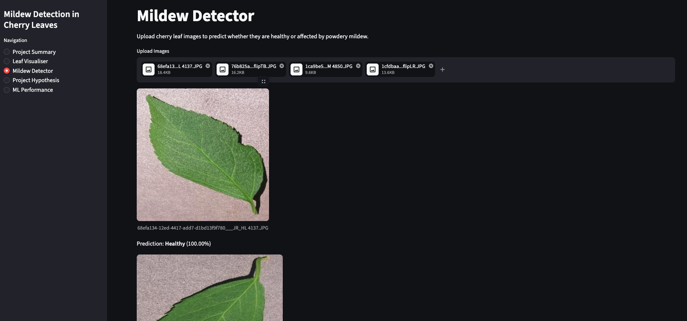

This image shows the results of the 4 uploaded images (identifying both healthy and mildew leaves correctly).

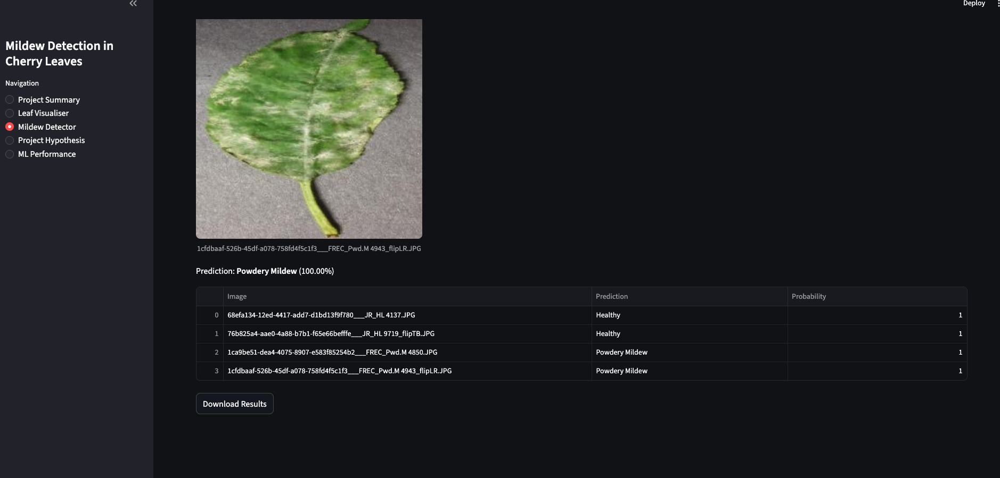

## User Story Testing

The following table outlines how each user story was tested to ensure the application meets the project requirements.

| User Story ID | Test | Expected Result | Actual Result | Pass/Fail |
|---|---|---|---|---|
| US01 | Open the Project Summary page | Project background is displayed clearly | Project background displayed | Pass |
| US02 | View the Business Requirements section on Project Summary | Both business requirements are listed | Both requirements displayed | Pass |
| US03 | Open Leaf Visualiser and expand Average Images | Average healthy and mildew images display | Images displayed correctly | Pass |
| US04 | Expand Variability Images section | Variability images display with explanation | Images and text displayed correctly | Pass |
| US05 | Expand Image Montage section | Healthy and mildew montage images display | Montage images displayed correctly | Pass |
| US06 | Upload multiple test images on Mildew Detector page | App accepts multiple images | Multiple images uploaded successfully | Pass |
| US07 | Review prediction output | Each image has a predicted label and probability | Predictions and probabilities displayed | Pass |
| US08 | Review results table after upload | Table contains image name, prediction and probability | Results table displayed correctly | Pass |
| US09 | Click CSV download button | Prediction results download as CSV | CSV downloaded successfully | Pass |
| US10 | Open Project Hypothesis page | Three hypotheses and validations are displayed | All hypotheses displayed in expanders | Pass |
| US11 | Open ML Performance page | Model accuracy, loss and confusion matrix are available | Performance plots displayed correctly | Pass |
| US12 | Use sidebar navigation | User can move between all pages | All pages accessible from sidebar | Pass |

### Responsiveness Testing

- Dashboard tested on different screen sizes
- Layout remains readable and functional

### Bugs and Fixes

- TensorFlow environment issues resolved by recreating virtual environment
- Path issues resolved by correcting directory structure

### Code Validation (PEP8)

The project code was tested using a PEP8 linter to ensure adherence to Python coding standards.

- All Python files were checked using a PEP8 compliance tool.
- Minor formatting issues (such as line length and spacing) were identified and corrected.
- The final codebase conforms to PEP8 standards with no major errors.

This ensures the code is clean, readable, and maintainable.
The code was validated using the PEP8 linter integrated in Visual Studio Code.

## Credits

- Dataset provided by Code Institute and Farmy & Foods
- Project guidance from course materials
- Code Institute Mentor: Mo Shami